# 老年肺癌患者症状群智能评估与全病程管理系统概要设计

> 文档版本：2026-08-22（含 Phase 5 · AI 升级）
> 客户：苏州市立医院（白塔院区），对接人：聂奕轩
> 范围：科研与护理管理系统演示版；不与 HIS、EMR、LIS、PACS 对接；演示账号见交付说明。

---

## 患者首页

患者打开移动端首页即可查看今日评估与任务，了解最新风险提示、责任护士与推荐宣教。首页内容随治疗阶段自动调整，重要信息以大字、清晰颜色与图标呈现，方便老年用户快速识别。Phase 5 起新增"AI 健康助手"主入口卡，显示任务完成率与对话入口。

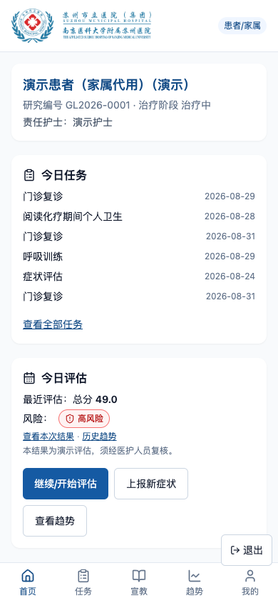

## 症状评估

患者可在分步表单中逐题作答，每题配 0—10 分量表与朗读按钮，结果页同时给出总分、主要症状、风险等级与变化趋势，演示声明清晰可见。

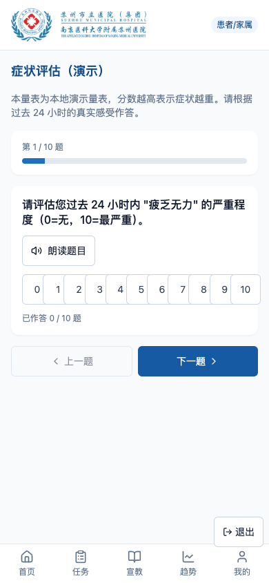

## 评估结果

已提交评估后系统给出总分、主要症状、风险等级与所属症状群（演示版 4 群映射），并提供历史趋势入口。结果页明确标注"演示评估，须经医护人员复核"。

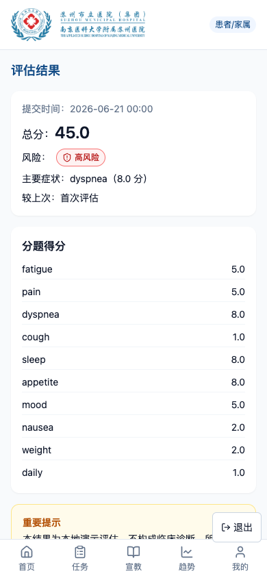

## 主动症状报告

当患者出现新症状或原有症状明显加重时，可通过主动报告表单填写症状、严重程度与发生时间，系统按演示规则评估并提示是否需要联系护士或就医。

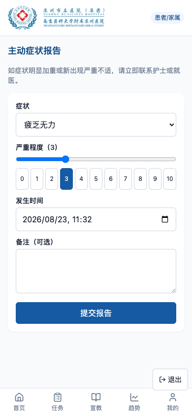

## 任务中心

任务中心集中展示今日、待完成与已完成的任务，患者可对任务提交完成、未完成或暂不适用反馈，反馈内容将作为护士调整护理路径的重要参考。

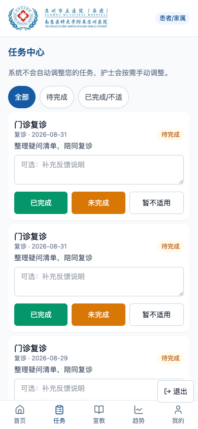

## 健康教育

健康教育按分类与治疗阶段呈现宣教资源，患者可逐条阅读、确认已读并启动语音朗读，便于家属协助理解与陪伴。

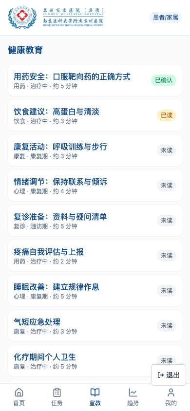

## 近三十天趋势

趋势页通过折线图直观展示近 30 天的总分与主要症状变化，并给出任务完成率与风险提示，帮助患者与家属共同观察康复过程。

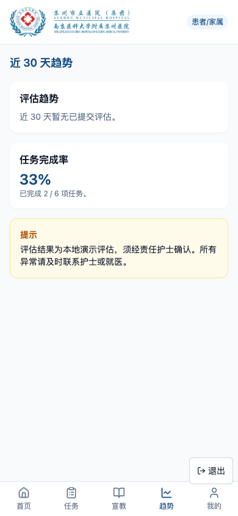

## 患者端 AI 健康助手

患者通过底部导航"AI 助手"或首页大入口卡进入 AI 健康助手页面。页面提供自由对话区与常见问题快捷提问（默认展开）。所有回复由本地 mock 智能体生成，并显式标注模型标识与免责声明。

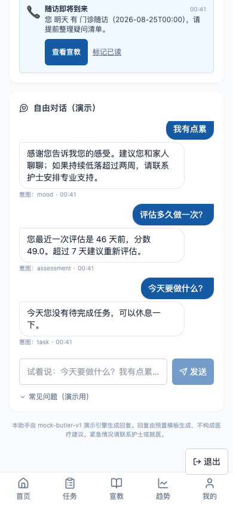

## 患者首页的三入口卡

首页首屏并排呈现"今日任务"与"今日评估"两个等高卡片，下方紧跟一张 AI 健康助手主入口卡。任务完成率与提示文案统一收纳到 AI 健康助手卡内。

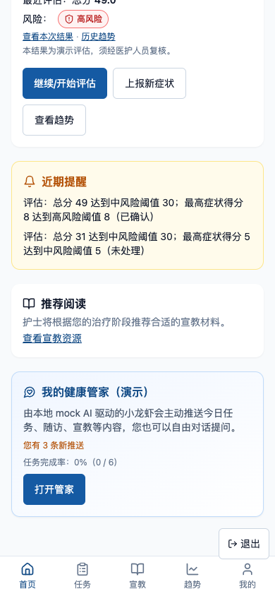

## 护士工作台

护士移动工作站的工作台一目了然展示负责患者、未处理预警、今日随访与逾期任务数量，便于其在繁忙时段快速进入待办事项。

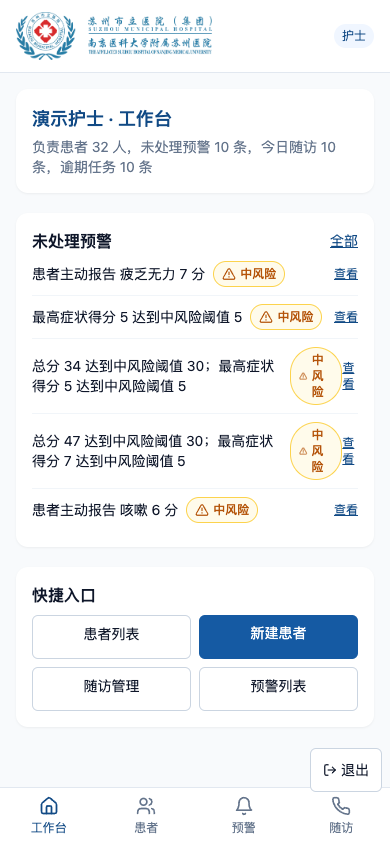

## 护士工作台升级（AI 与小部件）

升级版工作台新增 AI 知识库入口、风险分布、AI 采纳率等小部件，提供"打开 AI 助手"快速通道，把演示价值量做厚。

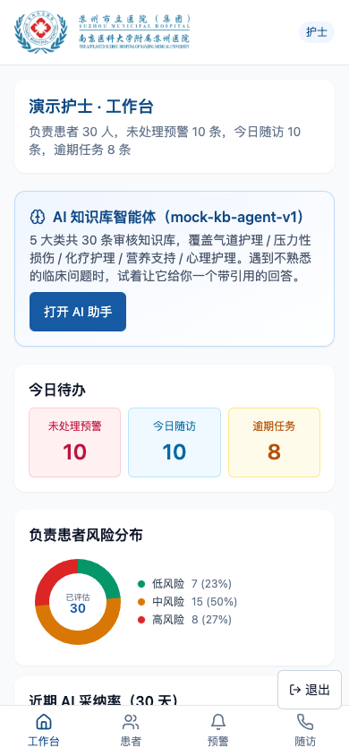

## 患者列表与建档

护士可在患者列表中按风险、治疗阶段与关键词筛选目标患者，并通过建档表单完成患者基本资料、研究编号与初始账号的创建，初始密码仅当次显示。

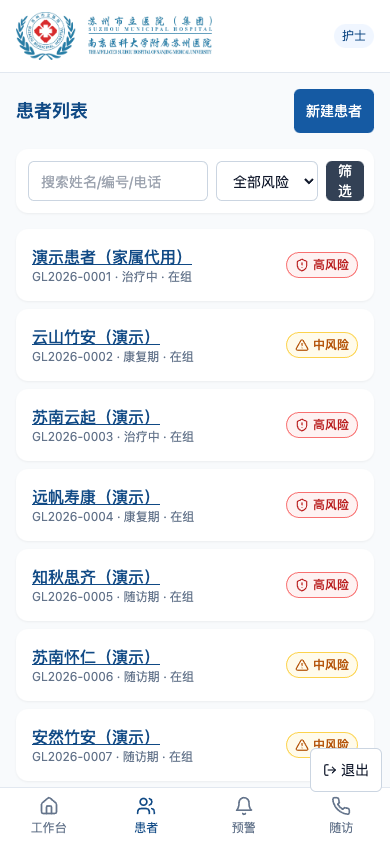

## 新建患者

新建患者表单要求填写姓名、电话、年龄、性别、诊断、治疗阶段与随访日期等必填项，并在事务内一次性生成患者档案与可登录账号。

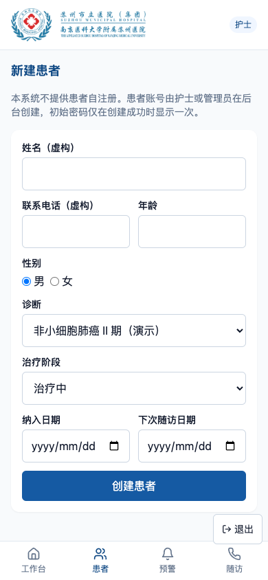

## 患者详情（含 AI 演示分析升级）

患者详情整合档案、最近评估、症状群归类、未处理预警与任务列表，并提供新增任务入口。Phase 5 升级后 AI 演示分析区按"4 维度归因 + 3 种风格（平衡 / 保守 / 积极） + 证据触发链 + 3 条建议 + 3 条随访计划"展示，护士可一键展开三风格对比。

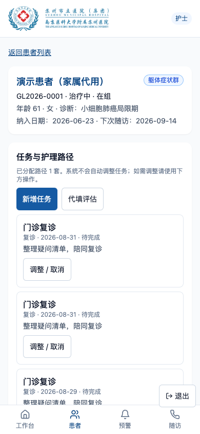

## AI 演示分析三风格对比

护士在同一患者详情页可点击"展开对比"，由本地 mock 引擎同时输出平衡型 / 保守型 / 积极型三种风格结果，仅用于"对比学习"，不写入数据库。

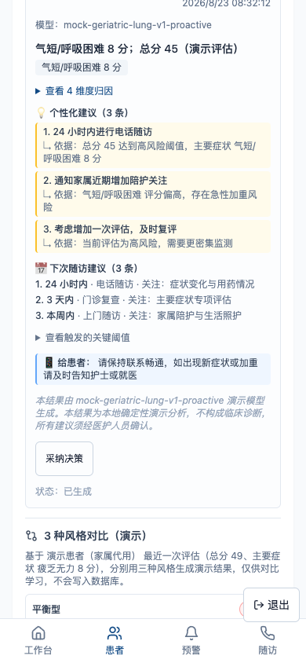

## 预警列表与详情

预警列表按时间倒序展示负责患者的全部预警，详情页明确给出触发依据、处理结果与干预记录，便于护士回顾与交接。Phase 5 起详情页底部新增"AI 处置草稿"按钮，可由 mock 智能体生成草稿后由护士编辑采纳。

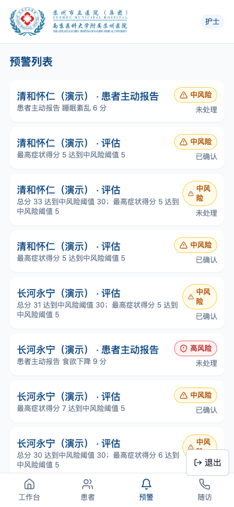

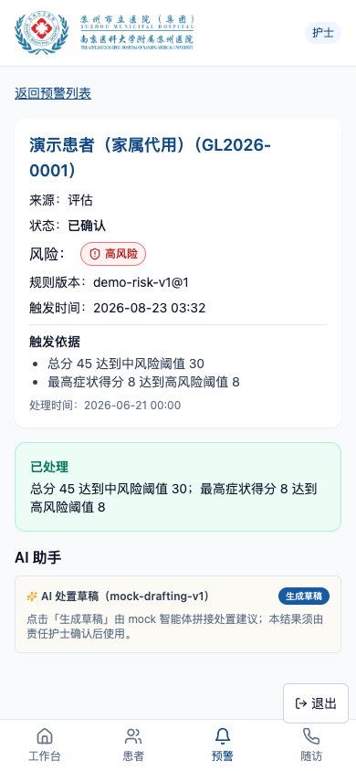

## 随访管理

随访管理集中呈现护士负责的随访记录，护士可在卡片上填写随访摘要并标记完成，确认完成后会记录后续随访建议。Phase 5 起每条计划随访下方新增"AI 随访摘要草稿"按钮，方便护士快速起草。

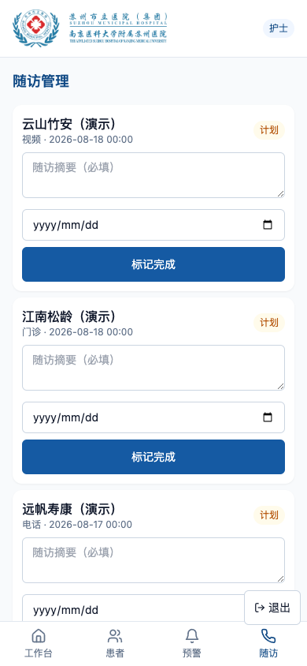

## 护士 AI 知识库智能体

护士工作台新增"AI 知识库智能体"入口，进入后可在 5 大类（气道护理 / 压力性损伤 / 化疗护理 / 营养支持 / 心理护理）共 30 条审核知识库中提问，本地 mock RAG 引擎会返回带引用与置信度的综合回答。系统同样会展示 8 个内置常见问题与最近 5 条提问历史。

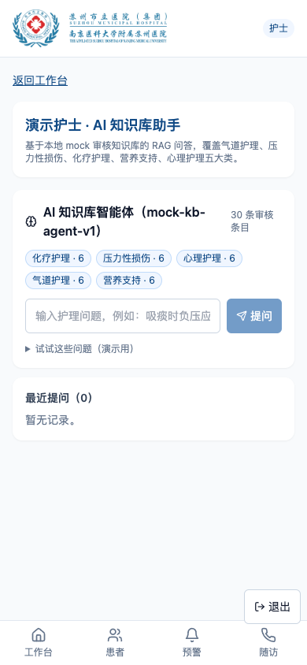

## 护士管理员驾驶舱

护士管理员驾驶舱汇总患者总数、在组、未处理预警、逾期任务、风险分布与近 30 天评估趋势，为资源调配与质量审查提供量化依据。

## 驾驶舱升级（AI 采纳率 / 症状群 / 高风险患者）

升级版驾驶舱新增 AI 演示分析采纳率（圆环图）、按症状群分布（条形图）、高风险患者 top 5 列表与知识库问答统计等小部件，让"AI 已落到哪里"在演示现场一目了然。

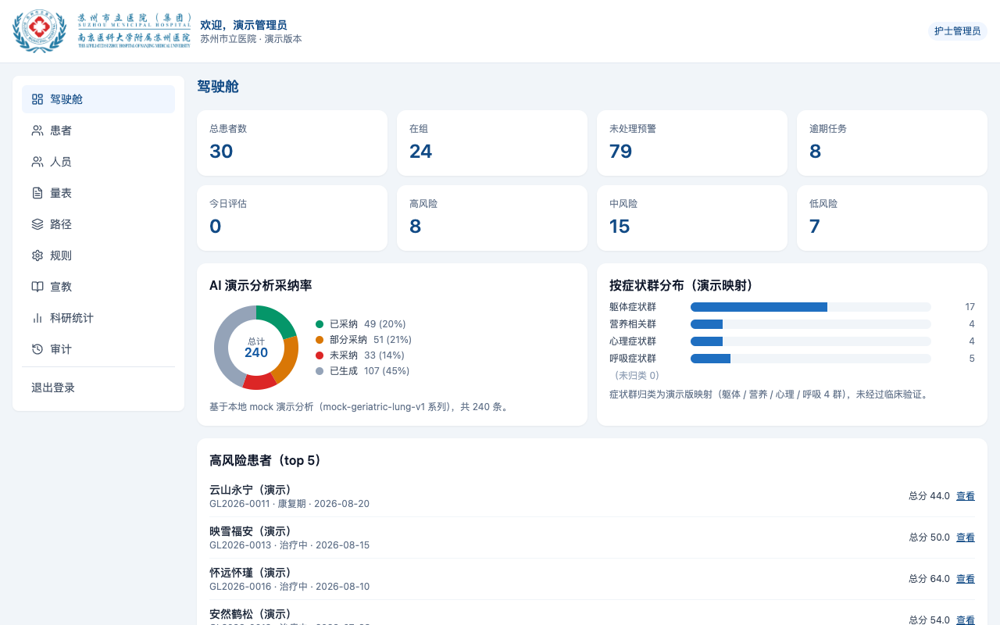

## AI 知识库管理

管理员可在 `/admin/ai/knowledge` 查看 30 条 mock 知识库条目的来源、审核人、标签、所属类别，并可切换类别浏览。本轮不开放新增 / 编辑功能以保证演示版内容可控。

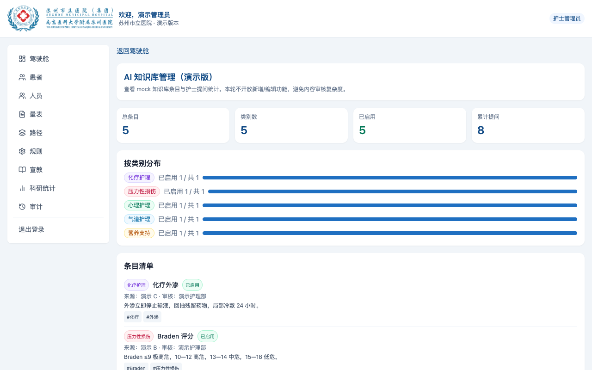

## 患者与人员管理

患者管理支持按阶段、状态与关键词筛选全量患者，人员管理提供账号启停、密码重置与显示名维护，所有敏感信息不可导出。

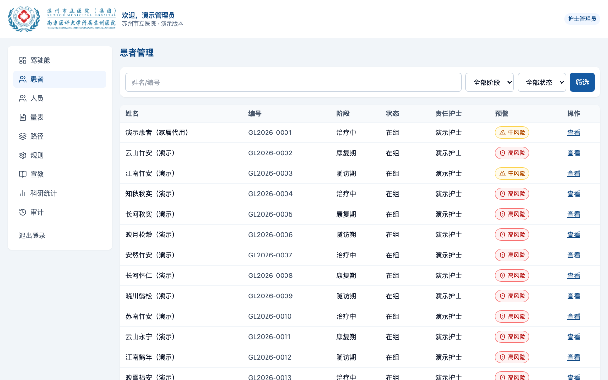

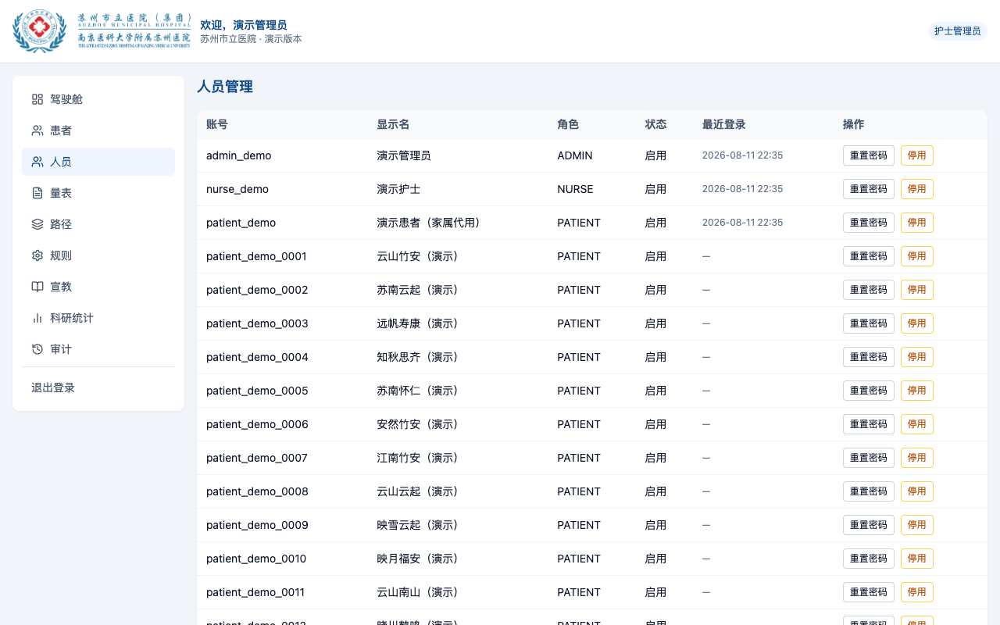

## 量表版本管理

量表版本管理展示本地演示量表的版本号、状态、题目数与更新时间，已发布版本产生评估数据后不可原地修改，新版本需另行发布。

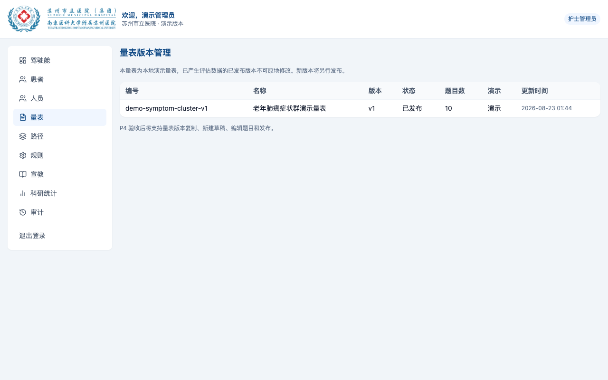

## 护理路径版本管理

护理路径版本管理按治疗阶段组织任务步骤，管理员可查看各版本的步骤构成与日期偏移，已发布路径不会自动覆盖已分配患者。

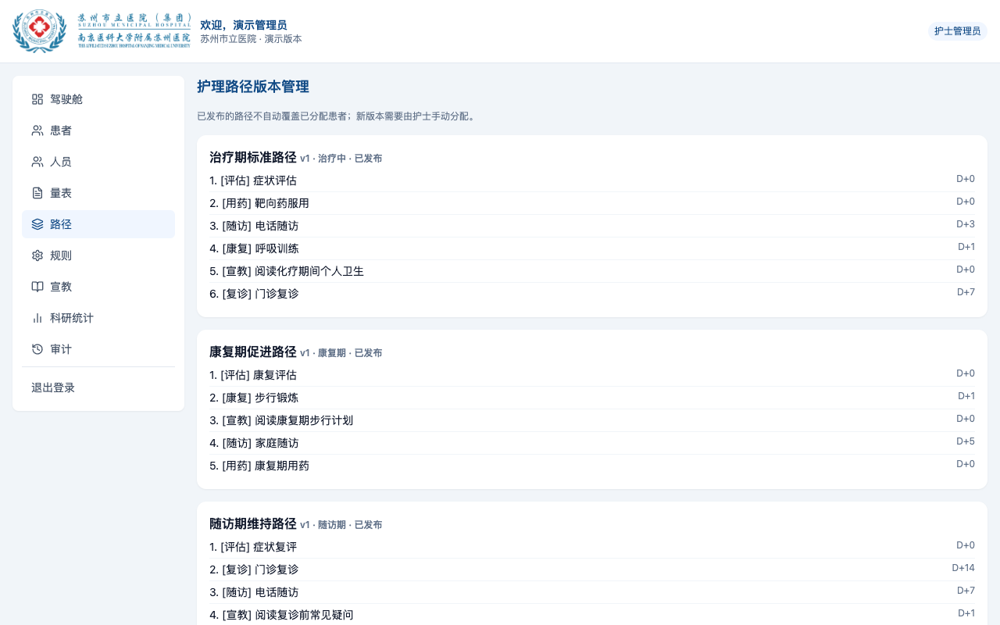

## 预警规则版本管理

预警规则版本管理展示当前演示风险规则的阈值与版本号，已生效规则的语义不被修改，历史评估保留触发快照以保证可追溯。

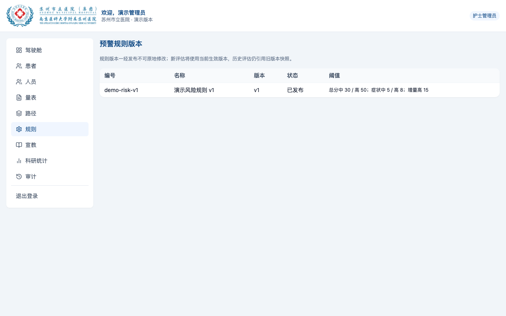

## 宣教资源管理

宣教资源管理按分类与治疗阶段维护文本宣教材料，所有内容由本地编辑，不引用图片、视频或外部链接，确保老年用户阅读体验稳定。

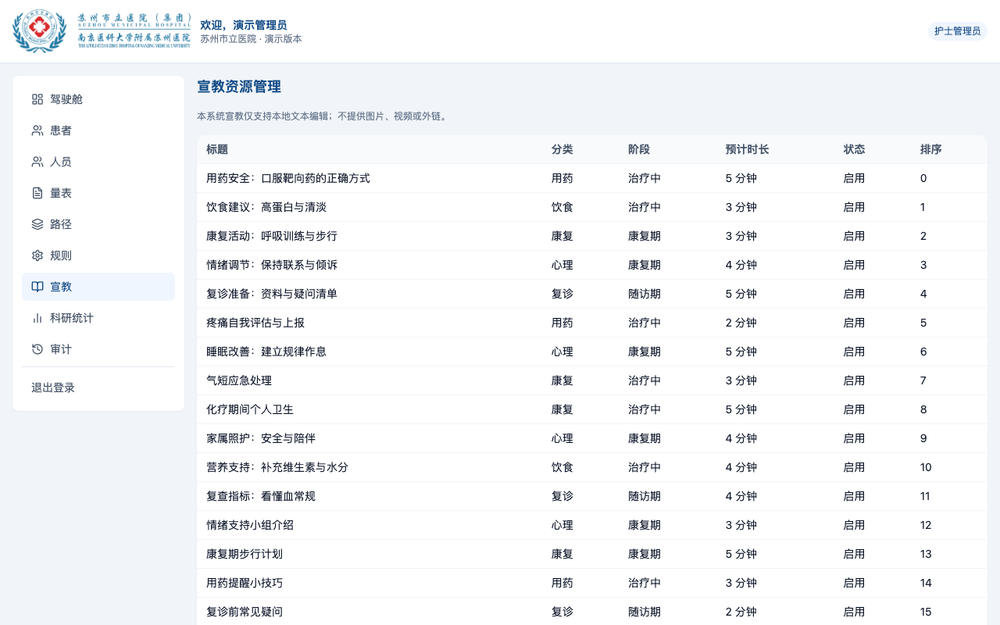

## 科研统计与导出

科研统计按治疗阶段、患者状态与风险进行聚合，并提供 UTF-8 BOM 中文 CSV 导出，导出文件已脱敏姓名、电话、账号与密码信息。

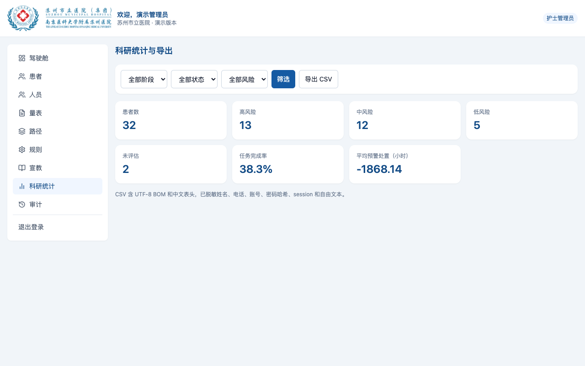

## 审计日志

审计日志提供关键操作的追溯能力，操作者、动作、对象与摘要清晰可见。Phase 5 起审计覆盖三件 AI（演示分析采纳 / 知识库问答 / AI 健康助手对话）。

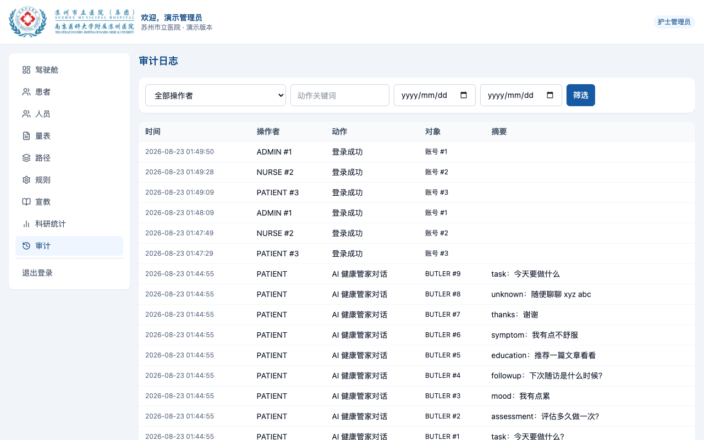
